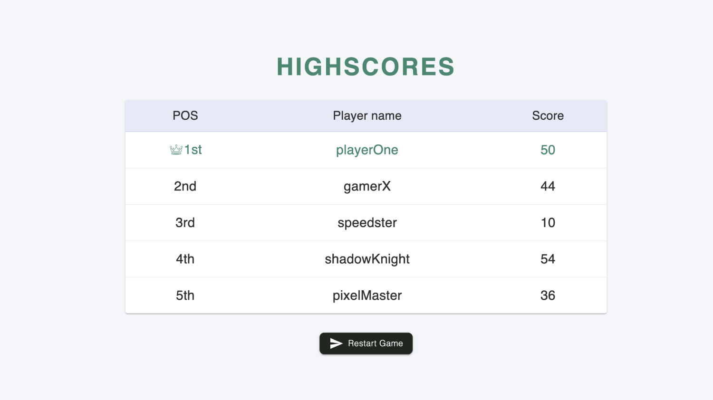

# BlinkTap Game

A fast-paced, reflex-based React game powered by a custom Node.js API. Tap the correct key fast enough to stay in the game and climb the live leaderboard.

---

**Live Game:**  
https://toulouse6.github.io/blink-tap/

**GitHub Repo:**  
https://github.com/Toulouse6/blink-tap/

---

## How to Play

1. Enter your name and click **Start Game**.
2. A shape appears randomly on the left** or right side.
3. Press:
   - `A` for left
   - `D` for right
4. You must respond **within 1 second**.

---

## Game Over Conditions

- User pressed the wrong key
- User pressed too early
- User pressed too late

---

## Leaderboard

At the end of your run, your score is submitted to the global leaderboard, showing the top 5 players. Try again to beat them!

---

## Tech Stack

- React + TypeScript
- Material UI
- HTML + CSS
- Axios
- Node.js (Backend API)

---

**Author:** Tal Argaman
